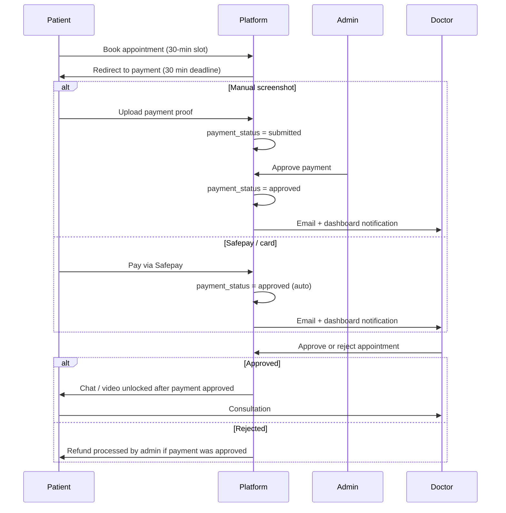
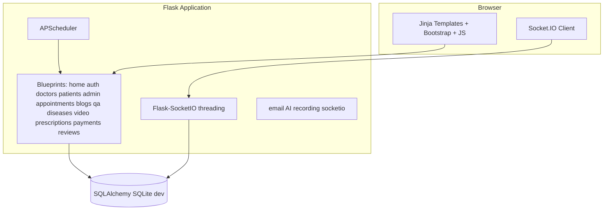

# Quick Care Connect

**Quick Care Connect** is a Flask-based healthcare platform for **Pakistan-oriented telehealth and in-clinic workflows**. It connects **patients**, **verified doctors**, and **admins** through appointment booking, **payment verification**, **live chat**, **video consultation (Agora)**, **digital prescriptions**, **medical history**, **Q&A**, **blogs**, **disease information**, doctor **reviews**, and an optional **AI assistant** on Q&A pages.

**Live site:** [https://quickcares.me](https://quickcares.me)

**Contributors:** see [CONTRIBUTORS.md](CONTRIBUTORS.md)

---

## Table of contents

1. [Core concepts](#1-core-concepts)
2. [Appointment & payment flow](#2-appointment--payment-flow)
3. [Visual design and UX](#3-visual-design-and-ux)
4. [Architecture](#4-architecture)
5. [Functional areas](#5-functional-areas-by-role-and-feature)
6. [Business rules](#6-business-rules-and-restrictions)
7. [Integrations](#7-integrations-third-party-and-apis)
8. [Configuration](#8-configuration-environment-variables)
9. [Installation and running](#9-installation-and-running)
10. [Project layout](#10-project-layout)
11. [Security notes](#11-security-and-operational-notes)
12. [Background jobs](#12-background-jobs-scheduler)
13. [Testing checklist](#13-suggested-testing-checklist)
14. [License](#license)

---

## 1. Core concepts

| Concept | Description |
|--------|-------------|
| **Multi-role platform** | One `User` model with `role` in `doctor`, `patient`, `admin`. Profiles are linked 1-to-1 (`Doctor`, `Patient`, `Admin`). Staff admins use granular RBAC (`AdminPanelGrant`). |
| **Appointment lifecycle** | Book → pay → admin verifies manual payment (if screenshot) → doctor approves/rejects → consultation → completion → optional review/dispute. See [§2](#2-appointment--payment-flow). |
| **Payment gate** | Chat, video, and consultation features for **patients** require `payment_status == 'approved'`. Doctor approve/reject actions require the same. |
| **Slot reservation** | A time slot is **not** blocked for other patients until payment is **approved** (unpaid bookings do not hide the slot). Slots are generated at **30-minute** intervals. |
| **Consultation integrity** | `prescription_unlocked` guards prescription flows so doctors cannot issue prescriptions without a logged consultation interaction. |
| **Doctor onboarding** | New doctors require **admin approval**; rejections drive an **appeal** flow capped at **three** appeals. |
| **Content moderation** | Doctor blogs need **admin approval** before publication; admins moderate Q&A and disease content. |
| **Localization / time** | Pakistan timezone helpers (`get_pakistan_now`); business deadlines use PKT. |

---

## 2. Appointment & payment flow

Current production flow (**payment before doctor approval**):



| Step | `appointment.status` | `payment_status` | Who acts |
|------|---------------------|------------------|----------|
| Booked | `pending` | `pending` | Patient must pay |
| Screenshot uploaded | `pending` | `submitted` | Admin reviews in **Payment Approvals** |
| Payment confirmed | `pending` | `approved` | Doctor sees Approve / Reject |
| Doctor accepts | `approved` | `approved` | Consultation (chat/video) |
| Doctor rejects | `rejected` | `approved` | Refund workflow |

Key implementation files:

- [`app/utils/appointment_workflow.py`](app/utils/appointment_workflow.py) — deadlines, doctor notification after payment
- [`app/utils/slots.py`](app/utils/slots.py) — 30-min slots, reserve slot only when `payment_status == 'approved'`
- [`app/routes/patients.py`](app/routes/patients.py) — booking, screenshot upload (`submitted`)
- [`app/routes/admin.py`](app/routes/admin.py) — admin payment approval
- [`app/routes/payments.py`](app/routes/payments.py) — Safepay (auto-`approved`)

---

## 3. Visual design and UX

- **Stack**: Server-rendered HTML with **Jinja2**, **Bootstrap 5.3**, **Font Awesome 6**, project CSS in [`app/static/css/main.css`](app/static/css/main.css).
- **Theme**: Emerald medical palette (`#10b981`), cards and shadows for dashboards.
- **Layouts**: [`app/templates/base.html`](app/templates/base.html) (app chrome), [`app/templates/home/landing_base.html`](app/templates/home/landing_base.html) (marketing pages).
- **Rich text**: **TinyMCE** (vendored) for blog authoring.
- **Realtime**: **Socket.IO** for chat and notifications.

---

## 4. Architecture



- **Application factory**: [`app/__init__.py`](app/__init__.py) — `db.create_all()`, schema guards, blueprints, Mail, SocketIO, scheduler.
- **Entry points**: [`run.py`](run.py) (local HTTPS dev), [`wsgi.py`](wsgi.py) (production Gunicorn).
- **Realtime**: `async_mode='threading'` (Python 3.12 compatible).
- **Database**: SQLite in development; use `DATABASE_URL` in production.

---

## 5. Functional areas (by role and feature)

### 5.1 Patient

- Register/login; complete profile for booking.
- Search doctors, book **physical** or **video** slots (30-minute intervals).
- Pay immediately after booking (Safepay or manual screenshot).
- After **payment approved** and **doctor approved**: chat, video, prescriptions, completion, reviews.
- Medical history, Q&A (with optional AI chat), blogs and diseases (read-only).

### 5.2 Doctor

- Register with PMC/credentials; await **admin approval**.
- Sees unpaid bookings as *Awaiting Payment*; sees *Admin Review* when screenshot is submitted.
- **Approve / Reject** only when `payment_status == 'approved'`.
- Chat, video, prescriptions, blogs (moderated), Q&A, earnings and payout requests.

### 5.3 Admin

- Doctor approval, appeals, blog/Q&A/disease moderation.
- **Payment Approvals** — manual screenshot verification before doctor is notified.
- Accounts: refunds, payouts, revenue.
- Optional **staff roles** with per-panel permissions (`admin_staff` routes).

### 5.4 Public

- Landing, about, FAQ, contact, doctor discovery — [`app/routes/home.py`](app/routes/home.py).

---

## 6. Business rules and restrictions

| Rule | Detail |
|------|--------|
| **Pay before doctor review** | Doctor is emailed only after payment is `approved` (admin for screenshots, auto for Safepay). |
| **Slot holds** | Unpaid `pending` bookings do not reserve the slot for others. |
| **Payment deadline** | 30 minutes from booking (or until slot start), then auto-cancel if unpaid. |
| **Patient chat/video** | Requires `payment_status == 'approved'` and `status == 'approved'`. |
| **Prescription unlock** | Consultation gates on chat/video interaction flags. |
| **Doctor appeals** | Max **3** appeals before suspension workflow. |
| **Commission & refunds** | `PLATFORM_COMMISSION_PERCENT`, cancellation/refund windows in [`config.py`](config.py). |
| **Sessions** | Long-lived cookies (1 year); users logout manually. |

---

## 7. Integrations

| Service | Purpose | Configuration |
|---------|---------|----------------|
| **Agora RTC** | Video consultations | `AGORA_APP_ID`, `AGORA_APP_CERTIFICATE` |
| **DigitalOcean Spaces** | Recording storage (optional) | `SPACES_*` env vars |
| **OpenRouter / Gemini** | AI Q&A assistant | `OPENROUTER_API_KEY` or `GEMINI_API_KEY` |
| **Safepay** | Card/checkout | Keys in environment (not hardcoded in production) |
| **Flask-Mail** | Transactional email | `MAIL_*` |

---

## 8. Configuration

See [`config.py`](config.py) and [`.env.example`](.env.example). Use a `.env` file locally; never commit secrets.

| Variable | Purpose |
|----------|---------|
| `FLASK_ENV` | `development` / `production` |
| `SECRET_KEY` | Flask secret |
| `DATABASE_URL` | SQLAlchemy URI |
| `AGORA_*` | Video tokens and optional cloud recording |
| `MAIL_*` | SMTP |
| `ADMIN_EMAIL` / `ADMIN_PASSWORD` | Optional bootstrap credentials |

---

## 9. Installation and running

### Prerequisites

- Python **3.10+** (tested on 3.12)
- `pip` and a virtual environment

### Steps

```bash
cd "Quick Care FYP"
python -m venv venv
venv\Scripts\activate          # Windows
pip install -r requirements.txt
```

Copy `.env.example` to `.env` and set `SECRET_KEY`, database, Agora, mail, and payment keys.

### Run locally

```bash
python run.py
```

Uses **HTTPS** on `https://localhost:5000` when `localhost+3.pem` and `localhost+3-key.pem` are present (generate with bundled `mkcert.exe.exe` if needed).

### Production

See [`deploy/`](deploy/) for Nginx, Gunicorn, and systemd templates. Production entry: `wsgi:app`.

---

## 10. Project layout

```
Quick Care FYP/
├── app/
│   ├── routes/          # Blueprints (home, auth, doctors, patients, admin, …)
│   ├── services/        # Email, Socket.IO, AI, recording
│   ├── utils/           # Auth, slots, appointment workflow, migrations
│   ├── jobs/            # Scheduled expiry / no-show logic
│   ├── templates/
│   └── static/
├── deploy/              # Nginx, Gunicorn, systemd
├── migrations/          # One-off schema scripts
├── config.py
├── run.py
├── wsgi.py
├── requirements.txt
├── CONTRIBUTORS.md
└── README.md
```

---

## 11. Security and operational notes

- Rotate `SECRET_KEY` and all API keys in production.
- Use HTTPS and `SESSION_COOKIE_SECURE=True` in production.
- File uploads limited by `MAX_CONTENT_LENGTH` (16 MB).
- AI responses are informational only — not a medical device.

---

## 12. Background jobs (scheduler)

| Interval | Job |
|---------|-----|
| **10 min** | Cancel unpaid appointments past payment deadline |
| **1 hour** | Auto-complete after patient review window |
| **5 min** | Expired appointments / no-show handling |

Implemented in [`app/scheduler.py`](app/scheduler.py).

---

## 13. Suggested testing checklist

- **Patient:** book → pay (screenshot + Safepay) → wait for admin (manual) → doctor approve → chat/video → complete → review.
- **Admin:** payment approvals for `submitted` + `pending` appointments; doctor/blog moderation.
- **Doctor:** no approve button until payment approved; slot visibility for unpaid bookings.
- **Cross-cutting:** Socket.IO blocked before payment; role-based access.

---

## License

Align license text with your university/FYP requirements before public release.

---

*Last updated: July 2026 — reflects payment-before-doctor-approval flow and 30-minute booking slots.*
